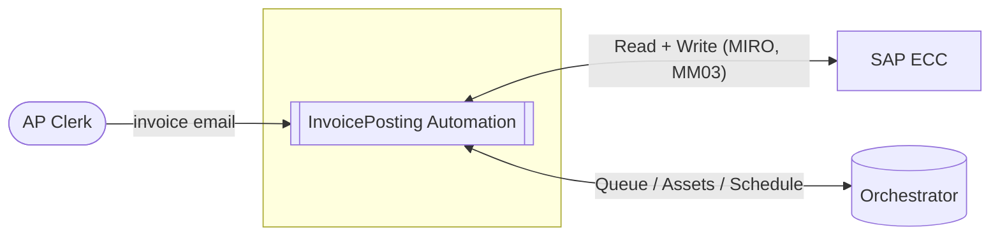
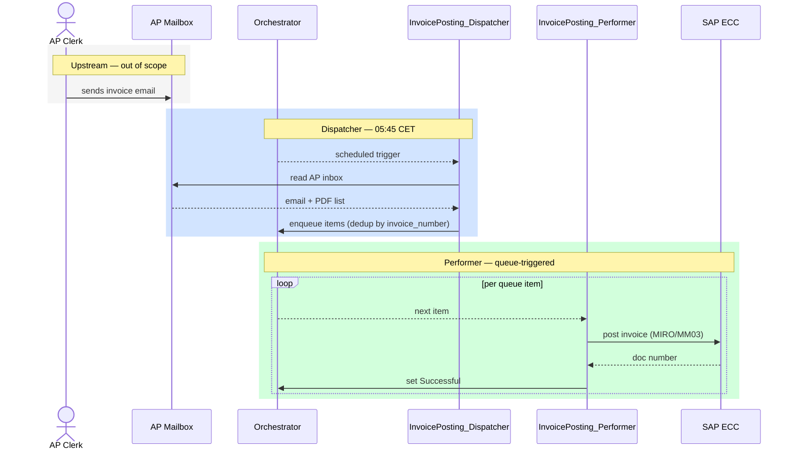

# Architecture Review — [Process Name]

> Markdown companion to `IA Arch Review & Estimation Template_RPA.xlsx`.
> Source PDD: `[pdd-file]` · SDD: `[sdd-file]`
> Version: 0.1 Draft · [YYYY-MM-DD]

## 1. Overview

<!-- #region solution_overview -->
[TBD — one sentence: what the automation does, which systems it connects, and the key business outcome.]
<!-- #endregion solution_overview -->

| | |
| --- | --- |
| **Process ID** | [TBD — e.g. IPA-2026-042] |
| **Status** | Draft / Review / Approved |
| **Priority** | High / Medium / Low |
| **Process Owner** | [TBD] |
| **Responsible Architect** | [TBD] |
| **Consultant / Developer** | [TBD] |
| **Requester** | [TBD] |
| **Target Go-Live** | [TBD] |
| **Robot Type** | BOR (Unattended / VM) · FOR (Attended) · Hybrid |
| **Orchestrator** | Automation Cloud (SaaS) · Automation Suite (on-premise) |

## 2. Business Context

### 2.1 Business Problem / Opportunity

<!-- Volume, frequency, AHT, FTE effort, pain points. Source: PDD sections 1–2. -->

<!-- #region business_problem -->
[TBD — what manual work exists today? Volume, frequency, AHT, FTE effort, pain points.]
<!-- #endregion business_problem -->

### 2.2 Proposed Solution Overview

<!-- Elaborate on the one-liner from section 1: end-to-end flow, key integration points, approach, reuse of existing patterns. Source: SDD system context + container inventory. -->

[TBD — elaborate here. What does the robot do start to end? Which systems does it touch? What is the outcome?]

### 2.3 In Scope / Out of Scope

**In Scope**

<!-- #region in_scope -->
- [TBD]
<!-- #endregion in_scope -->

**Out of Scope**

<!-- #region out_of_scope -->
- [TBD]
<!-- #endregion out_of_scope -->

### 2.4 Success Criteria

<!-- #region business_objectives -->
- [TBD]
<!-- #endregion business_objectives -->

## 3. Technology Platform Selection

SA marks each UiPath platform component: **In Scope** · **Out of Scope** · **Considered / Rejected** · **TBD**. Rejected components link to the relevant ADR in section 4.4. Source: SDD section 2.2.

<!-- #region technology_overview -->
| Layer | Component | Selection |
| --- | --- | --- |
| Discovery | Process Mining | TBD |
| Discovery | Task Mining | TBD |
| Discovery | Communications Mining (discovery) | TBD |
| Automation | RPA — Unattended / VM Robot (BOR) | TBD |
| Automation | RPA — Attended (FOR) | TBD |
| Automation | Integration Service (API connectors) | TBD |
| Automation | Maestro / Workflow Orchestration | TBD |
| Automation | Agents (Agentic / LLM-driven) | TBD |
| Automation | Test Automation (Test Suite) | TBD |
| Cognitive / AI | Document Understanding / IDP | TBD |
| Cognitive / AI | AI Center (custom models) | TBD |
| Cognitive / AI | Communications Mining (runtime) | TBD |
| Human-in-the-loop | Action Center | TBD |
| Human-in-the-loop | Apps (custom UI) | TBD |
| Data & Reporting | Data Service | TBD |
| Data & Reporting | Insights | TBD |
| Data & Reporting | Process Mining (operational) | TBD |
| Infrastructure | Automation Cloud (SaaS) | TBD |
| Infrastructure | Automation Suite (on-premise / k8s) | TBD |
| Infrastructure | Serverless Robots | TBD |
| Infrastructure | VM-based Robots | TBD |
<!-- #endregion technology_overview -->

## 4. Solution Architecture

### 4.1 System Context

The automation in its environment — external actors, connected systems, and the automation boundary. Source: SDD section 3.1.

<!-- #region system_context -->
| Name | Role | Direction | In Scope | Notes |
| --- | --- | --- | --- | --- |
| SAP ECC | Source + Target | Read + Write | Yes | |
| UiPath Orchestrator | Platform | Read + Write | Yes | Queue management |
<!-- #endregion system_context -->

### 4.2 Process Sequence

End-to-end time-ordered flow across all components. Source: SDD section 3.2.

<!-- #region process_sequence -->

<!-- #endregion process_sequence -->

### 4.3 Component Overview

Solution components from SDD section 3.3. Each component maps to a UiPath platform archetype — drives infrastructure, licensing, and team structure decisions.

<!-- #region containers -->
| Component | Archetype | Framework | Trigger | Queue boundary |
| --- | --- | --- | --- | --- |
| InvoicePosting_Dispatcher | rpa_dispatcher | Linear | Schedule 05:45 CET Mon–Fri | writes → `InvoicePosting` |
| InvoicePosting_Performer | rpa_performer | REFramework | Queue — `InvoicePosting` | reads ← `InvoicePosting` |
| InvoicePosting_Aggregator | rpa_aggregator | Linear | Schedule 08:30 CET Mon–Fri | reads ← `InvoicePosting` (completed items) |
<!-- #endregion containers -->

> **Component archetype catalog:** `rpa_dispatcher` · `rpa_performer` · `rpa_aggregator` · `rpa_tool` · `maestro` · `agent` · `api_workflow` · `web_app` · `rpa_library`

### 4.4 Architecture Decision Records

Key architectural choices made for this project. Full ADRs in `docs/adr/`.

<!-- #region adr_inventory -->
| ID | Title | Status | Affects |
| --- | --- | --- | --- |
| ADR-0001 | Use REFramework for queue-based Performer projects | Accepted | sdd, tdd |
| ADR-0002 | Coded Config (TOML) for runtime settings | Accepted | tdd |

#### ADR-0001 — Use REFramework for queue-based Performer projects

**Status:** Accepted
**Affects:** sdd, tdd

**Context:** The Performer project processes Orchestrator queue transactions one at a time. A custom retry and state-management loop would replicate behaviour already provided by the standard UiPath REFramework.

**Decision:** Adopt REFramework as the Performer shell. Business logic lives exclusively in `Process/` workflows invoked from Process Transaction. The Init, GetTransactionData, and SetTransactionStatus states are left intact …

---

#### ADR-0002 — Coded Config (TOML) for runtime settings

**Status:** Accepted
**Affects:** tdd

**Context:** Config.xlsx is fragile under source control: binary diffs are unreadable, merge conflicts cannot be resolved, and environment-specific values require a manual file overwrite at deploy time.

**Decision:** Replace Config.xlsx with per-environment TOML files (`Config_Dev.toml`, `Config_Test.toml`, `Config_Prod.toml`) loaded by a `CodedConfig` activity. TOML is plain text, diff-friendly, and supports typed values natively …
<!-- #endregion adr_inventory -->

## 5. Risks and Assumptions

### 5.1 Risks

| # | Risk | Likelihood | Impact | Mitigation | Gate |
| --- | --- | --- | --- | --- | --- |
| 1 | [TBD] | High / Medium / Low | High / Medium / Low | [TBD] | Pre-Dev / Pre-UAT / Pre-GoLive |
<!-- example: | 1 | SAP UI selector fragility | Medium | High | Resilience testing; quarterly smoke run | Pre-UAT | -->

### 5.2 Assumptions

| # | Assumption | Owner | Valid Until |
| --- | --- | --- | --- |
| 1 | [TBD] | [TBD] | [TBD] |

## 6. Estimation

> Full line-item breakdown in `[ProcessName]-estimation.md`.

### 6.1 Cost Summary

<!-- #region estimation_summary -->
| Item | Value |
| --- | --- |
| PD rate | [TBD] |
| Contingency pct | [TBD] |
| Total base pds | [TBD] |
| Total effort pds | [TBD] |
| Build cost | [TBD] |
<!-- #endregion estimation_summary -->

### 6.2 Effort by Phase

| Phase | Effort (PDs) |
| --- | --- |
| Discovery | 4 |
| Design | 5 |
| Build | [TBD] |
| Test | 6 |
| Deploy | 7 |
| **Total** | **[TBD]** |

## 7. Return on Investment

> Full derivation in `[ProcessName]-roi.md`.

<!-- #region roi_summary -->
| Item | Value |
| --- | --- |
| Monthly volume | [TBD] |
| AHT saved min | [TBD] |
| FTE cost rate | [TBD] |
| FTE hours saved month | [TBD] |
| Monthly labour saving | [TBD] |
| Monthly run cost | [TBD] |
| Monthly net saving | [TBD] |
| Annual net saving | [TBD] |
| Build cost | [TBD] |
| Payback months | [TBD] |
| Year 1 net benefit | [TBD] |
| Year 3 net benefit | [TBD] |
<!-- #endregion roi_summary -->

## 8. Board Decision

| Item | Value |
| --- | --- |
| Decision | Go / No-go / Conditional Go |
| Conditions | [TBD] |
| Decision Date | [TBD] |
| Board Members Present | [TBD] |
