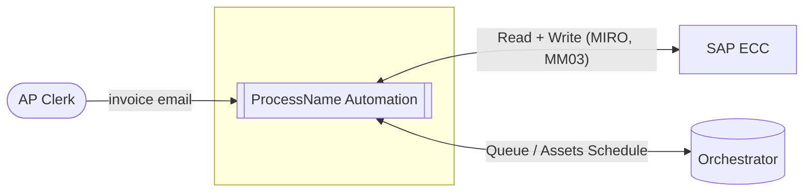
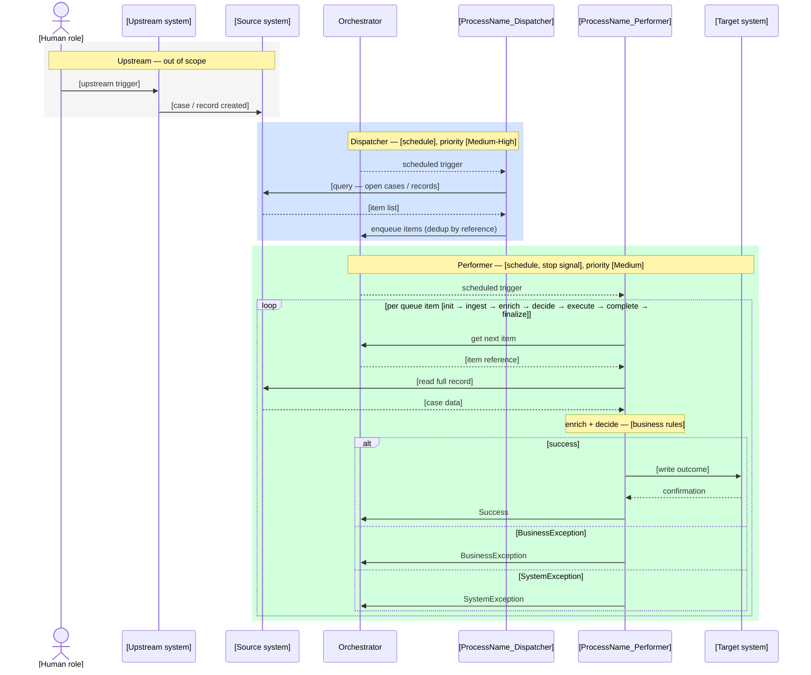

# Solution Design Document (SDD)

**Process / Master Project Name:** {{ process_name or "[TBD]" }}

<!-- #region sdd_header -->
| Item | Value |
| --- | --- |
| SDD Version | 0.1 |
| SDD Date | [YYYY-MM-DD] |
| SDD Status | Draft |
| PDD Reference | [TBD] |
<!-- #endregion sdd_header -->

## Document History

<!-- #region sdd_history -->
| Version | Date | Author | Role | Changes |
| --- | --- | --- | --- | --- |
| 1.0 | [YYYY-MM-DD] | [TBD] | Solution Architect | Initial draft |
<!-- #endregion sdd_history -->

## Document Approvals

<!-- #region sdd_approvals -->
| Version | Role | Name | Department | Date |
| --- | --- | --- | --- | --- |
| 1.0 | Solution Architect | [TBD] | [TBD] | |
| 1.0 | Development Lead | [TBD] | [TBD] | |
| 1.0 | Process Owner | [TBD] | [TBD] | |
<!-- #endregion sdd_approvals -->

## 1. Purpose and Scope

### 1.1 Purpose

[TBD — 3–5 sentences: what the automation does, inputs, outputs, key design decisions]

Design priorities: **Robustness · Scalability · Efficiency · Reusability**

Mirrored from PDD section 1.1 — edit in the PDD; re-generate the SDD to propagate changes.

<!-- #region objectives -->
- [TBD]
- [TBD]
<!-- #endregion objectives -->

### 1.2 Scope

Mirrored from PDD section 3.3 — edit in the PDD; re-generate the SDD to propagate changes.

#### In Scope

<!-- #region in_scope -->
| Step | Description |
| --- | --- |
| [TBD] | |
<!-- #endregion in_scope -->

#### Out of Scope

<!-- #region out_of_scope -->
| Activity / Step | Reason | Impact on TO-BE | Future Automation Path |
| --- | --- | --- | --- |
| [TBD] | | | |
<!-- #endregion out_of_scope -->

### 1.3 Constraints and Assumptions

Document technical constraints and design assumptions that bound the solution so developers know what they cannot change and what they are taking for granted.

<!-- What technical constraints apply — network, access, performance? What design assumptions are you making about data quality, volume stability, or downstream systems? -->

<!-- #region constraints -->
| # | Type | Statement |
| --- | --- | --- |
| 1 | Constraint | [TBD] |
| 2 | Assumption | [TBD] |
<!-- #endregion constraints -->

## 2. Context

### 2.1 Stakeholders

Record all key contacts so every team member knows who to reach for business decisions, approvals, system access, and compliance.

<!-- Who are the key contacts? For the PDD: process owner, business sponsor, BA, PM, Works Council rep, and DPO. For the SDD: per-system technical contacts — who to call for firewall rules, account provisioning, and system access requests. -->

<!-- #region contacts_technical -->
| Role | Name | System | Email |
| --- | --- | --- | --- |
| System Owner | Alice Müller | SAP ECC | alice.mueller@example.com |
| Network / Firewall | Bob Tan | Infra | bob.tan@example.com |
<!-- #endregion contacts_technical -->

### 2.2 Technology Overview

Capture the selected UiPath platform configuration required for Works Council review and infrastructure provisioning. Rationale and alternatives belong in ADRs.

<!-- Which UiPath runtime components are required — robot type (unattended/attended), Orchestrator type (Cloud/Suite), execution mode (XAML/Coded/Hybrid), and scalability requirements? State selected values only; document the why in docs/adr/. -->

<!-- #region technology_overview -->
| Layer | Component | Selection |
| --- | --- | --- |
| Discovery | Process Mining | TBD |
| Discovery | Task Mining | TBD |
| Discovery | Communications Mining (discovery) | TBD |
| Automation | RPA — Unattended / VM Robot (BOR) | TBD |
| Automation | RPA — Attended (FOR) | TBD |
| Automation | Integration Service (API connectors) | TBD |
| Automation | Maestro / Workflow Orchestration | TBD |
| Automation | Agents (Agentic / LLM-driven) | TBD |
| Automation | Test Automation (Test Suite) | TBD |
| Cognitive / AI | Document Understanding / IDP | TBD |
| Cognitive / AI | AI Center (custom models) | TBD |
| Cognitive / AI | Communications Mining (runtime) | TBD |
| Human-in-the-loop | Action Center | TBD |
| Human-in-the-loop | Apps (custom UI) | TBD |
| Data & Reporting | Data Service | TBD |
| Data & Reporting | Insights | TBD |
| Data & Reporting | Process Mining (operational) | TBD |
| Infrastructure | Automation Cloud (SaaS) | TBD |
| Infrastructure | Automation Suite (on-premise / k8s) | TBD |
| Infrastructure | Serverless Robots | TBD |
| Infrastructure | VM-based Robots | TBD |
<!-- #endregion technology_overview -->

<!-- #region technology_config -->
| Item | Value |
| --- | --- |
| UiPath Version | [TBD] |
| Execution Mode | XAML / Coded C# / Hybrid |
<!-- #endregion technology_config -->

## 3. Architecture

### 3.1 System Context *(C4 Level 1)*

The automation in its environment — external actors, connected systems, and the automation boundary. No internal structure.

<!-- What external systems does the robot connect to, what data flows in/out, and what actors (humans, upstream processes) interact with the automation? -->

<!-- #region system_context -->
| Name | Role | Direction | In Scope | Notes |
| --- | --- | --- | --- | --- |
| SAP ECC | Source + Target | Read + Write | Yes | |
| UiPath Orchestrator | Platform | Read + Write | Yes | Queue management |
<!-- #endregion system_context -->

### 3.2 Process Sequence

End-to-end time-ordered flow across all containers — the SA's technical re-expression of the TO-BE process as a Mermaid sequence diagram.

<!-- Describe the end-to-end sequence across containers: scheduling trigger, Dispatcher query and enqueue, Performer per-item loop, and handoff to any Aggregator or downstream system. -->

<!-- #region process_sequence -->

<!-- #endregion process_sequence -->

### 3.3 Containers *(C4 Level 2)*

Deployable UiPath projects with framework, trigger, robot type, and queue contract — the C4 Level 2 view.

<!-- How many deployable projects are needed (Dispatcher, Performer, Aggregator)? What triggers each, what framework does each use, and what Orchestrator queue connects them? -->

<!-- #region containers -->
| # | Component | Archetype | Framework | Trigger | Runtime | Queue boundary |
| --- | --- | --- | --- | --- | --- | --- |
| 1 | `[TBD]_Dispatcher` | rpa_dispatcher | Linear workflow | Scheduled — [TBD] | Unattended | Writes → `[TBD]` |
| 2 | `[TBD]_Performer` | rpa_performer | REFramework | Queue-triggered + scheduled stop signal | Unattended | Reads ← `[TBD]` |
| 3 | `[TBD]_Aggregator` | rpa_aggregator | Linear workflow | Scheduled — [TBD] | Unattended | *(optional — remove if not applicable)* |

**Queue contract — `[TBD]`:** item carries `[TBD — unique reference field]` as deduplication key. Dispatcher writes one item per source record; Performer reads and processes one item per REFramework transaction; the only write-back from Performer to Orchestrator is the transaction status (Success / BusinessException / SystemException) and output properties.

> **Component archetype catalog:** `rpa_dispatcher` · `rpa_performer` · `rpa_aggregator` · `rpa_tool` · `maestro` · `agent` · `api_workflow` · `web_app` · `rpa_library`
<!-- #endregion containers -->

### 3.4 Component Inventory *(C4 Level 3)*

Module-level inventory with stable IDs and archetypes — the C4 Level 3 view that connects architecture to effort estimation and test planning.

<!-- For each pipeline stage (shell, init, ingest, enrich, decide, execute, complete, finalize), what module handles it, which application does it touch, what surface, and what exception IDs does it raise? -->

<!-- ID format: cmp_{stage}_{application_or_purpose} — lowercase, underscore-separated. IDs must be stable; they are referenced by effort estimates, ADRs, and generated test tasks. enrich and execute may have multiple rows — add one per application or processing variant. Standard REFramework shell modules (marked ‡) have catalog-based effort; process-specific modules (marked †) require bespoke estimation. -->

<!-- #region components -->
| ID | Stage | Archetype | Module | Responsibility | Application | Surface | Receives | Produces | Exception refs |
| --- | --- | --- | --- | --- | --- | --- | --- | --- | --- |
| cmp_shell_init | shell | standard_ref_shell | InitAllApplications ‡ | Open and authenticate to all target applications before the transaction loop | [TBD] | ui | — | — | SE-01 |
| cmp_shell_close | shell | standard_ref_shell | CloseAllApplications ‡ | Close all open applications regardless of transaction outcome | [TBD] | ui | — | — | — |
| cmp_init_validate | init | standard_ref_shell | Validate ‡ | Verify required queue item fields are present; initialise transaction scope | — | — | TransactionItem | InitResult | BE-01 |
| [TBD] | ingest | [TBD] | Ingest[Source] † | Read the full source record for this transaction | [TBD] | [TBD] | InitResult | RawData | SE-01 |
| [TBD] | enrich | [TBD] | Enrich[Reference] † | Augment with reference data or lookups not in the queue item | [TBD] | [TBD] | RawData | EnrichedItem | [TBD] |
| [TBD] | decide | rule_decide | Decide † | Apply business rules; select processing path; detect business exceptions | — | — | EnrichedItem | Decision | BE-01, BE-02 |
| [TBD] | execute | [TBD] | Execute[Target] † | Write outcome to target system — primary action of the automation | [TBD] | [TBD] | Decision | ExecutionResult | SE-02 |
| [TBD] | complete | [TBD] | Complete[Source] † | Update source system status; write Orchestrator output properties | [TBD] | [TBD] | ExecutionResult | CompletedItem | SE-01 |
| cmp_finalize | finalize | standard_ref_shell | Finalize ‡ | Release resources; write structured audit entry; return status to REFramework | — | — | CompletedItem | — | — |

> ‡ Standard REFramework module — effort from catalog, no bespoke estimation.
> † Process-specific — effort driven by archetype, application, and exception count.
> **Archetype catalog:** `standard_ref_shell` · `email_ingest` · `ui_ingest` · `api_ingest` · `file_ingest` · `file_parse` · `api_enrich` · `ui_enrich` · `db_enrich` · `dto_mapping` · `rule_decide` · `sap_gui_execute` · `api_execute` · `ui_execute` · `queue_enqueue` · `api_complete` · `ui_complete`
> Applications not previously automated carry additional selector resilience effort — cross-reference the applications list `previously_automated` flag.
<!-- #endregion components -->

### 3.5 Capacity and Throughput Analysis

Calculate machine utilisation against the processing window to determine whether one runtime is sufficient or scaling is required.

<!-- Given the volume and per-item timing, what is the expected machine utilisation and is one runtime sufficient? -->

<!-- #region volume -->
| Item | Value |
| --- | --- |
| Daily volume (items) | [TBD] |
| Peak volume (items) | [TBD] |
| Average handling time per item (min) | [TBD] |
| Processing window (min) | [TBD] |
| Items per runtime per day | [TBD — window ÷ AHT] |
| Runtimes required (standard load) | [TBD] |
| Runtimes required (peak load) | [TBD] |
| Scalable | Yes / No |
| Queue SLA | [TBD] |
<!-- #endregion volume -->

### 3.6 Recommended Runtime Count

State the minimum number of runtimes required to meet the SLA under peak conditions so infrastructure is provisioned correctly.

<!-- Based on the utilisation analysis, how many runtimes are needed at standard and peak load, and what threshold should trigger an auto-scaling event? -->

<!-- #region recommended_runtime_count -->
| Scenario | Volume | Runtimes Required | Notes |
| --- | --- | --- | --- |
| Standard load | [TBD] | [TBD] | |
| Peak load | [TBD] | [TBD] | Peak utilisation: [TBD]% |
| Scaling trigger | — | — | [TBD — queue depth / time threshold] |
<!-- #endregion recommended_runtime_count -->

### 3.7 ADR Inventory

Document key architectural choices — context, option selected, and trade-offs accepted — so reviewers and future developers understand why the implementation looks the way it does. Source files live in `docs/adr/` — render via `--adr-dir docs/adr/`, parse back via `scripts/cpm_rpa/adr.py`.

<!-- What non-obvious design choices require justification — framework selection, execution mode, exception strategy, deployment pattern? For each, document the context, decision, alternatives, and consequences. -->

<!-- #region adr_inventory -->
| ID | Title | Status | Affects |
| --- | --- | --- | --- |
| ADR-0001 | Use REFramework for queue-based Performer projects | Accepted | sdd, tdd |
| ADR-0002 | Coded Config (TOML) for runtime settings | Accepted | tdd |

#### ADR-0001 — Use REFramework for queue-based Performer projects

**Status:** Accepted
**Affects:** sdd, tdd

**Context:** The Performer project processes Orchestrator queue transactions one at a time. A custom retry and state-management loop would replicate behaviour already provided by the standard UiPath REFramework.

**Decision:** Adopt REFramework as the Performer shell. Business logic lives exclusively in Process/ workflows invoked from Process Transaction. The Init, GetTransactionData, and SetTransactionStatus states are left intact; no modifications are made to the REFramework flow.

**Consequences:** Developers must understand REFramework state semantics. Non-standard retry logic is not permitted inside the Process Transaction state. Framework upgrades require re-baselining the shell from the current UiPath template.

---

#### ADR-0002 — Coded Config (TOML) for runtime settings

**Status:** Accepted
**Affects:** tdd

**Context:** Config.xlsx is fragile under source control: binary diffs are unreadable, merge conflicts cannot be resolved, and environment-specific values require a manual file overwrite at deploy time.

**Decision:** Replace Config.xlsx with per-environment TOML files (Config_Dev.toml, Config_Test.toml, Config_Prod.toml) loaded by a CodedConfig activity. TOML is plain text, diff-friendly, and supports typed values natively without extra parsing.

**Consequences:** Robots require .NET 8 and the CodedConfig NuGet package. All asset references migrate to TOML keys. The legacy Config.xlsx and its loading workflow are removed from the project.
<!-- #endregion adr_inventory -->

## 4. Component Design Detail

Design decisions and runtime configuration for each component from section 3.3. One subsection per component — heading remains SA-editable; re-render the region below to regenerate content from the component inventory.

### 4.1 `InvoicePosting_Dispatcher` *(rpa_dispatcher)*

<!-- #region component_design_rpa_dispatcher -->
Reads the AP inbox, extracts invoice metadata from each email–PDF pair, and enqueues one item per invoice. Runs at 05:45 CET so the queue is populated before the 06:00 CET Performer trigger. Deduplication happens here — the Performer never checks for duplicates.

| Item | Decision | Rationale |
| --- | --- | --- |
| Source | AP mailbox — IMAP, folder Inbox, subject filter "Invoice" | Business confirmed all invoices arrive via this single channel |
| Deduplication | Reference = invoice_number; skip if item already in queue | Prevents double-posting when Dispatcher reruns before Performer drains the queue |
| On empty mailbox | Complete silently | No invoices is normal on public holidays — an alert would create noise |
| Schedule | 05:45 CET Mon–Fri | 15 min lead time ensures queue is populated before Performer trigger |
| Queue written | `InvoicePosting` | |
| Config method | Orchestrator Assets / TOML | |
<!-- #endregion component_design_rpa_dispatcher -->

### 4.2 `InvoicePosting_Performer` *(rpa_performer)*

<!-- #region component_design_rpa_performer -->
One REFramework transaction = one vendor invoice. The queue item `Reference` carries the invoice number — used as the deduplication key and the correlation ID in all log messages.

SAP MIRO posting is **not idempotent** — retrying a failed post risks creating a duplicate FI document. Retry count in PROD is therefore 0. DEV/TEST allows 1 retry to recover from transient test-environment instability without incurring posting risk.

| Item | Decision | Rationale |
| --- | --- | --- |
| Retry count (PROD) | 0 | MIRO posting is not idempotent — a retry could produce a duplicate FI document |
| Retry count (DEV/TEST) | 1 | Tolerates transient SAP TST flakiness; no production risk |
| Max consecutive SE | 3 | Three consecutive faults indicate infrastructure failure — abort and page ops |
| ShouldMarkJobAsFaulted | true (PROD) | Ensures Orchestrator alerts ops when the abort threshold is reached |
| Multiple resolutions | No | SAP GUI requires 1920×1080; one standard resolution VM is sufficient at this volume |
| Queue read | `InvoicePosting` | |
| Config method | Orchestrator Assets / TOML | |

**Queue contract (read from `InvoicePosting`):**

| Field | Type | Required | Notes |
| --- | --- | --- | --- |
| Reference | string | yes | Invoice number — deduplication key; must never be blank |
| vendor_id | string | yes | SAP vendor account number |
| invoice_date | string | yes | DD.MM.YYYY — parsed to DateTime in Init stage |
| total_amount | string | yes | DE decimal format (1.234,56) — normalised to decimal in Init stage |
| currency | string | yes | EUR / USD / GBP — triggers BE-01 if outside this set |
| po_number | string | yes | Must exist in SAP MM03 — missing PO triggers BE-02 |
| source_email_id | string | no | IMAP Message-ID retained for traceability audit; not used in processing |
<!-- #endregion component_design_rpa_performer -->

### 4.3 `InvoicePosting_Aggregator` *(rpa_aggregator)* *(optional — remove if not applicable)*

<!-- #region component_design_rpa_aggregator -->
Generates a daily posting summary after all Performer transactions complete. Triggered by a scheduled job 30 minutes after the Performer stop-signal, giving the last transactions time to close.

| Item | Decision | Rationale |
| --- | --- | --- |
| Trigger | Scheduled — 08:30 CET Mon–Fri | 30 min after Performer stop signal; allows last transactions to settle |
| Input | Orchestrator queue `InvoicePosting` — Succeeded and Failed items from today's run | |
| Output | XLSX report emailed to AP team distribution list | Format requested by business; no dashboard tooling available yet |
| Config method | Orchestrator Assets / TOML | |
<!-- #endregion component_design_rpa_aggregator -->

### 4.4 `SAPPosting.Library` *(rpa_library)* *(optional — add one subsection per library; remove if none)*

<!-- #region component_design_rpa_library -->
Provides reusable SAP GUI automation workflows for the Invoice Posting solution — consumed by `InvoicePosting_Performer`. Packaged as a NuGet library so the posting logic can be tested and versioned independently from the Performer's REFramework shell.

| Item | Decision | Rationale |
| --- | --- | --- |
| NuGet package ID | `DHL.RPA.AP.SAPPosting` | Follows DHL team namespace convention |
| Exported workflows | `PostInvoice(vendor_id: string, amount: decimal, gl_account: string) → posted: boolean, doc_number: string` | Single entry point; all SAP navigation encapsulated inside |
| Consumers | `InvoicePosting_Performer` | Dispatcher has no SAP interaction; library is Performer-only |
| Framework | XAML (UI Automation activities) | SAP GUI requires XAML for selector-based navigation |
| Config passing | Arguments only — no Orchestrator Assets | Performer retrieves config from Assets/TOML and passes it as arguments |
| Versioning strategy | SemVer — breaking argument changes bump major version | Prevents silent breakage when Performer is upgraded separately |
<!-- #endregion component_design_rpa_library -->

## 5. Integration Specification

Derived — generated from AS-IS applications (`automation_surface`, `in_scope`), Credentials / security (`auth_method`), and component inventory (stage → direction). Do not edit manually; update the source sections instead.

<!-- #region integrations -->
| # | System | Integration Method | Direction | Auth Method |
| --- | --- | --- | --- | --- |
| 1 | [TBD] | REST API / DB / UI / File | Read / Write / Both | OAuth / Basic / Windows |
<!-- #endregion integrations -->

## 6. Exception Handling

Capture known application failures and define the robot's recovery behaviour so production incidents stay within expected bounds.

<!-- What application errors, login failures, timeouts, or infrastructure faults has this process experienced? How should the robot respond to each? -->

### 6.1 Known Application Errors

<!-- #region application_errors -->
[TBD]
<!-- #endregion application_errors -->

### 6.2 Default System Exception Recovery

<!-- #region default_se_handling -->
- Retry the current step up to `[DEFAULT: 3]` times
- If unresolved: log the error, send alert to `[TBD — ops@company.com]`, terminate cleanly
<!-- #endregion default_se_handling -->

### 6.3 Exception Type → Robot Action

<!-- #region exception_handling -->
| Exception Type | Trigger | Robot Action | Max Retries | Escalation |
| --- | --- | --- | --- | --- |
| Business Exception | Invalid / unexpected data | Log + skip transaction | 0 | Email to BizOps |
| System Exception — Known | App crash / timeout | Restart app + retry | 3 | Alert ops if unresolved |
| System Exception — Unknown | Unexpected error | Log + kill cleanly | 1 | Alert ops with screenshot |
<!-- #endregion exception_handling -->

## 7. Reporting and Monitoring

Define the monitoring and reporting outputs the business and operations teams need to trust and maintain the robot in production.

<!-- What does the business need to monitor — frequency, granularity, and tooling? What does the ops team need to track the robot in production? -->

Mirrored from PDD section 3.6 — edit in the PDD; re-generate the SDD to propagate changes.

<!-- #region reporting_requirements -->
| # | Report Type | Frequency | Details | Tool |
| --- | --- | --- | --- | --- |
| 1 | Process execution summary | Daily | Run count, duration, success/fail ratio | Orchestrator dashboard |
| 2 | Transaction log | Per run | Per-item status, error category | Orchestrator |
| 3 | [TBD] | | | |
<!-- #endregion reporting_requirements -->

## 8. Security and Compliance

### 8.1 System Access Prerequisites

Identify every access gate — approvals, accounts, firewall rules — that must be cleared before the robot can run, so blockers surface early.

<!-- For each system the robot connects to, what must be arranged before the robot can run — system owner approval, account provisioning, firewall rules, static IP whitelisting, and any other access gating steps? Who owns each action and by when? -->

<!-- #region system_prerequisites -->
| System | Prerequisite | Detail | Owner | Status | Gate |
| --- | --- | --- | --- | --- | --- |
| SAP ECC | System owner approval | Business owner must approve robot access | TBD | Open | Pre-Dev |
| SAP ECC | Account provisioning | Dedicated automation account (not personal dev account) | IT Infrastructure | Open | Pre-Dev |
| SAP ECC | Firewall / IP whitelist | Static IP of robot VM must be whitelisted | Network | Open | Pre-Dev |
| SAP ECC | User permissions | Minimum required roles / T-codes | SAP admin | Open | Pre-Dev |
<!-- #endregion system_prerequisites -->

### 8.2 Access Control

Derived from technology_overview infrastructure/robot-type components and any "Robot Account" rows in section 8.1.

<!-- #region access_control -->
| Item | Value |
| --- | --- |
| Robot account | [TBD — dedicated Entra ID automation account; not a personal developer account] |
| Privilege level | [TBD — local admin / standard user] |
| MFA / session policy | [TBD] |
<!-- #endregion access_control -->

### 8.3 Credential Management

Ensure every system authentication is documented with auth method, asset type, and rotation policy so the robot is secure and maintainable.

<!-- What credentials are needed, how are they stored, and what data protection or compliance considerations apply? -->
<!-- Asset type: use Credential for username + password pairs; use Text for tokens, API keys, private keys, and URLs. Wrong type is a defect. -->

<!-- #region system_credentials -->
| System | Environment | Auth Method | Credential Asset | Asset Type | Rotation | Status |
| --- | --- | --- | --- | --- | --- | --- |
| SAP ECC | Test | Windows SSO | PPO_SAP_Test_Credentials | Credential | Quarterly | Open |
| SAP ECC | Production | Windows SSO | PPO_SAP_Prod_Credentials | Credential | Quarterly | Open |
<!-- #endregion system_credentials -->

### 8.4 Data Protection and Compliance

Document personal data handling — GDPR legal basis, data minimisation, retention policy, and Works Council status — so the automation meets compliance requirements.

<!-- What personal data does the robot process? What is the GDPR legal basis? What is the retention policy, and what is the Works Council requirement status? -->

<!-- #region data_protection -->
| Item | Value |
| --- | --- |
| PII present | Yes / No |
| GDPR legal basis | [TBD — e.g., Art. 6(1)(b) contract performance] |
| Data minimisation | [TBD — what data is retained after processing] |
| Data retention | [TBD] |
| Audit trail | Orchestrator job logs + transaction logs |
| Mitbestimmung / works council | [TBD — required / not required / completed] |
| Other compliance | [TBD] |
<!-- #endregion data_protection -->

## 9. Estimation

<!-- Authoritative data in `<process-name>-estimation.md` and `<process-name>-roi.md`. -->
<!-- This section is a reference summary — edit in the source documents, then re-generate. -->

<!-- #region estimation_summary -->
| Item | Value |
| --- | --- |
| PD rate | [TBD] |
| Contingency pct | [TBD] |
| Total base pds | [TBD] |
| Total effort pds | [TBD] |
| Build cost | [TBD] |
<!-- #endregion estimation_summary -->

<!-- #region roi_summary -->
| Item | Value |
| --- | --- |
| Monthly net saving | [TBD] |
| Annual net saving | [TBD] |
| Payback months | [TBD] |
| Year 1 net benefit | [TBD] |
| Year 3 net benefit | [TBD] |
<!-- #endregion roi_summary -->

## 10. Observations

### 10.1 Future Improvements

<!-- #region observations_improvement -->
- [ ] [TBD]
- [ ] [TBD]
<!-- #endregion observations_improvement -->

### 10.2 Removed from Scope

<!-- #region observations_removal -->
*No items removed from scope.*
<!-- #endregion observations_removal -->

## 11. Glossary

See `[ProcessName]-glossary.md` in the project folder.
